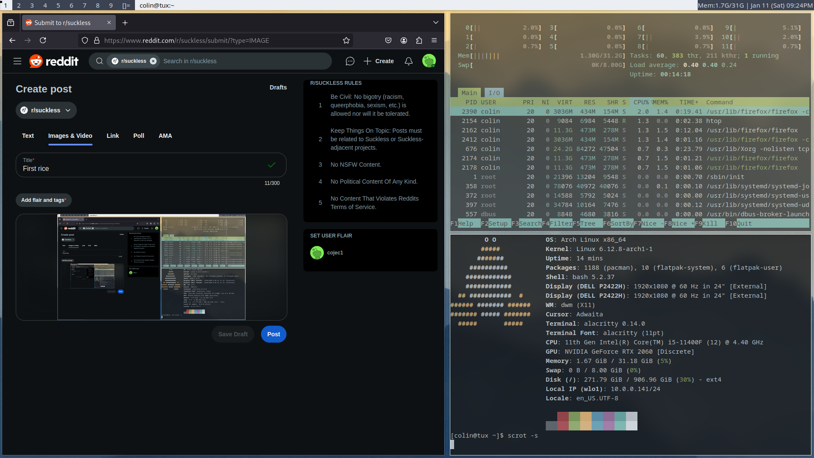

# dwm-dotfiles
colins dwm configs

Feel free to open an issue if you have a question!

*this was first written at 1:50 am. It does look bad. sorry.*

These are my dwm dotfiles for my arch linux dwm install, it has barely anything and is relatively simple.**This is not professional or formatted by any means! Read this to understand how to apply them. I am also writing this from the top of my head so it may be wrong. TELL ME IF IT IS**

## install neovim, or vim.. please..

#### please do these steps in order
# Steps

# patches
  ***DO THIS FIRST***
  I used uselessgaps , and while not a package i also added dwmblocks which i will go over here.
  go to https://dwm.suckless.org/patches/uselessgap/ and save the .diff file into your dwm folder. I reccomend renaming it to something like "gaps.diff" Run `patch -p1 < gaps.diff` then `sudo make clean install` **IT IS LIKELY THERE WILL BE AN ERROR..** do not panic. run `rm config.h &&make` that should(?) fix it. (i'll run it in a VM later to see if thats true. APOLOGIES IF IT BROKE YOUR DWM!) and then run the sudo make clean install command again and reboot

*dwmblocks*
go to the dwmblocks github, copy the code and git clone in a folder. Do `make` and then `sudo make install` then put it in your .xinitrc and reboot.

# dwm config.h
INSTALL
* alacritty
* noto-fonts  

 just copy and paste my config.h to yours. then run `sudo make clean install` and reboot
 
# picom
INSTALL 
* picom

run this stuff in this order

`cd .config` (FROM ~ DIRECTORY) ~ `mkdir picom` `cp /etc/xdg/picom.conf ~/.config/picom/picom.conf` `cd picom` `nvim picom.conf` then literally copy and paste my picom.conf.

# epik images111!! 

